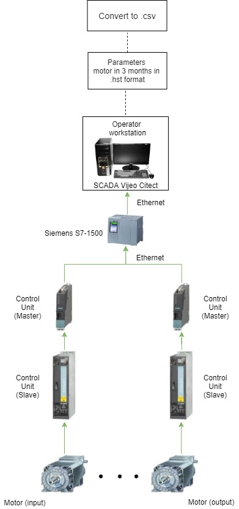

# Predictive models of the parameters of the motor installation transverse orientation

The production of BOPP films is a complex process. One of the steps is the transverse stretching of the film. This function performs the installation transverse orientation. In order for the production line not to disturb the course of its work, the motors at the inlet and at the exit of the installation transverse orientation nust be synchronized. Therefore, the motors parameters are studied to obtain predictions.

  
  Fig.1 Installation transverse orientation
 

Data collection is shown in the following figure.

  
  Fig.2 Data collection
 

